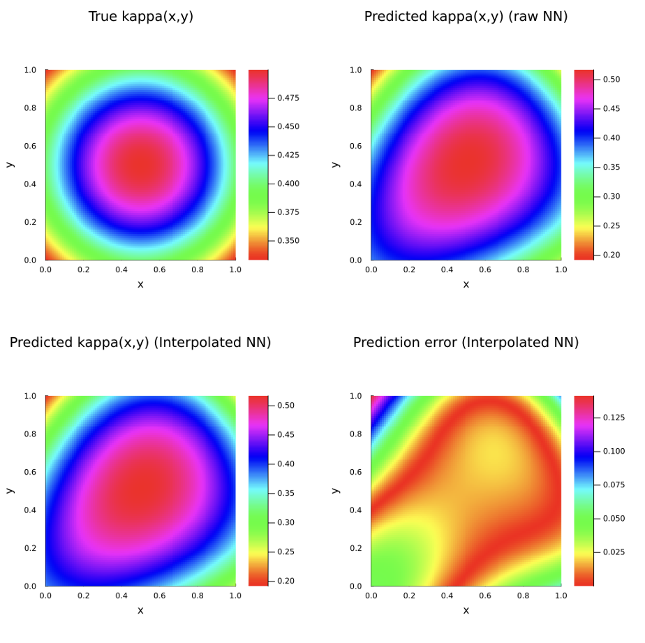
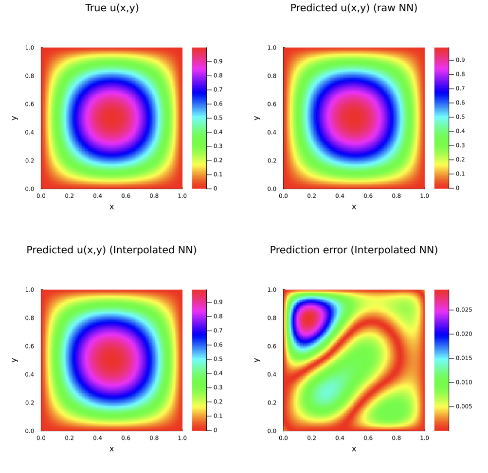

### Introduction

This notebook demonstrates how to fit a simple finite element interpolated neural network (FEINN) to an inverse problem with sparse, noisy measurements.

### Setup

First, activate the environment and load the required libraries.

```Julia
using Pkg
Pkg.activate("../")

using FiniteElementChains
using Gridap
using Flux
using Gridap.FESpaces
using Gridap.ReferenceFEs
using Gridap.Arrays
using Gridap.Geometry
using Gridap.Fields
using Gridap.CellData
using Gridap.Algebra
using Zygote
using LinearAlgebra
using ForwardDiff
using Distributions
using ChainRules
using Plots
using DelimitedFiles
using Optim
```

Next, we'll set up our test solution. For this problem, the true state and diffusion coefficient are given by:

\begin{equation}
    u(x,y) = sin(\pi x)sin(\pi y),\ \kappa (x) = \frac{1}{1 + x^2 + y^2 + (x-1)^2 + (y-1)^2}
\end{equation}

The underlying physics are represented by the variable coefficient poisson equation:

\begin{equation}
    \nabla \cdot (\kappa (x,y) \nabla u(x,y)) = f(x,y)
\end{equation}

The domain is given by $[0,1]^2$ and is split into 50x50 quadrilaterals. This is the problem used in section 6.2.2 of Badia et al (2024).

For this problem, we'll assume we can observe the true state at 64 points inside the domain, contaminated with Gaussian noise. This is analogous to evenly spaced thermocouples.

```Julia
u(x) = sin(pi*x[1])*sin(pi*x[2])
kappa(x) = 1/(1 + x[1]^2 + x[2]^2 + (x[1] - 1)^2 + (x[2] - 1)^2)

grad_u(x) = ForwardDiff.gradient(u, x)
grad_u(x::VectorValue{2, Float64}) = ForwardDiff.gradient(u, get_array(x))

grad_kappa(x) = ForwardDiff.gradient(kappa, x)
grad_kappa(x::VectorValue{2, Float64}) = ForwardDiff.gradient(kappa, get_array(x))

lap_u(x) = ForwardDiff.gradient(j -> grad_u(j)[1], x)[1] + ForwardDiff.gradient(j -> grad_u(j)[2], x)[2]
lap_u(x::VectorValue{2, Float64}) = ForwardDiff.gradient(j -> grad_u(j)[1], get_array(x))[1] + ForwardDiff.gradient(j -> grad_u(j)[2], get_array(x))[2]

f_s(x) =  -1.0* (grad_kappa(x) ⋅ grad_u(x) +  kappa(x) * lap_u(x))
```

Below, we'll set up our problem using Gridap. Notice we instantiate spaces for both $\kappa (x)$, and for $u (x)$.

```Julia
# set up Gridap Model
order = 1
domain = (0,1,0,1)
partition = (50,50)
model = CartesianDiscreteModel(domain,partition)

reffe = ReferenceFE(lagrangian,Float64,order)

degree = 2
Ω = Triangulation(model)
dΩ = Measure(Ω,degree)

# set up for the u function

V0 = TestFESpace(model,reffe,conformity=:H1,dirichlet_tags="boundary")
U = TrialFESpace(V0,u)
assem = SparseMatrixAssembler(U,V0)

# set up for the kappa function
V2 = TestFESpace(model,reffe,conformity=:H1)
U_kap = TrialFESpace(V2)
assem_k = SparseMatrixAssembler(U_kap,V2)

# set up overall problem
v_fef = get_fe_basis(V0)
resfunc(k,u,v) = ∫(k*( ∇(v)⋅∇(u) ))*dΩ - ∫( v*f_s )*dΩ
resfunc_ku(k,u) = resfunc(k,u,v_fef)
```

Now, let's extract 64 sensor locations, predict their true values, and contaminate them with gaussian noise.

```Julia
# extract 64 sensor locations, assign them a gaussian noise sensor reading
newarrarr = rand(49,49)
newarrind = collect(1:2401)
for i in eachindex(newarrarr)
    newarrarr[i] = newarrind[i]
end
known_coord_ids = vec([Int(i) for i in newarrarr[[3,9,15,21,27,33,39,45],[3,9,15,21,27,33,39,45]]])

known_coords = Ω.grid.node_coords[2:(end-1),2:(end-1)][known_coord_ids]
known_values = u.(known_coords) .+ rand(Normal(0,0.05), length(known_coords))

# set interior and all nodes
interior_coords = [get_array(i) for i in Ω.grid.node_coords[2:(end-1),2:(end-1)]]
all_coords = [get_array(i) for i in Ω.grid.node_coords]
```

Finally, let's instantiate the structs that will be used to fit our FEINN.

```Julia
U_kap_coords = get_coord_mat(all_coords)
U_u_coords = get_coord_mat(interior_coords)

cell_ids_field = get_cell_ids_field(Ω)
dofmap = get_dof_map(U,cell_ids_field,known_coords)

pdesetup = PDESetup(U,U_kap,assem,assem_k,U_u_coords,U_kap_coords)
sensordata = SensorData(known_values,known_coords,dofmap)
nnsetup = initialize_networks()
```

### Training the models

To train the FEINN, simply call train_feinn!. This will modify the parameters in `nnsetup` in place. The models are trained using BFGS and Optim.jl. Typically, we train these models in three stages--first, training the $u(x,y)$ network to minimize data fitting error as a "Warm start," then training $\kappa(x,y)$ to minimize the FEM residual with a fixed $u(x,y)$ network, followed by a continuation strategy where the joint data and FEM errors are minimized with increasing weight on the FEM residual.

See Badia et al (2024) for more information on how these models are trained.

```Julia
train_feinn!([300,100,300], [1.0,3.0], resfunc_ku, nnsetup, pdesetup, sensordata)
```

### Evaluation

Now, let's evaluate the results. First, we'll take the $L^2(\Omega)$ norm of the prediction error for $u (x)$. Then, we'll plot the predicted results for both $u$ and $\kappa$.

```Julia
nx, ny = 100, 100
xs = range(0, 1, length=nx)
ys = range(0, 1, length=ny)

dx = xs[2]-xs[1]
dy = ys[2]-ys[1]

xedges = range(xs[1]-dx/2, xs[end]+dx/2, length=nx+1)
yedges = range(ys[1]-dy/2, ys[end]+dy/2, length=ny+1)

function heatmap_feinn(xedges,yedges,err,title)
    p = heatmap(
        xedges,
        yedges,
        err,
        aspect_ratio=:equal,
        xlims=(0,1),
        ylims=(0,1),
        c=:hsv,
        xlabel="x",
        ylabel="y",
        title=title,
        size=(400,400),
        margin=5Plots.mm,
        grid=false
    )
    return p
end

kpred_nn = [nnsetup.re_k(nnsetup.θ_k)([x,y])[1] for y in ys, x in xs]
kpred_feinn = [nnsetup.re_k(nnsetup.θ_k)([x,y])[1] for y in ys, x in xs]
ktrue = [kappa([x,y]) for y in ys, x in xs]
kerr = [abs(kappa([x,y]) - nnsetup.re_k(nnsetup.θ_k)([x,y])[1]) for y in ys, x in xs]

p1 = heatmap_feinn(xedges,yedges,ktrue,"True kappa(x,y)")
p2 = heatmap_feinn(xedges,yedges,kpred_nn,"Predicted kappa(x,y) (raw NN)")
p3 = heatmap_feinn(xedges,yedges,kpred_feinn,"Predicted kappa(x,y) (Interpolated NN)")
p4 = heatmap_feinn(xedges,yedges,kerr,"Prediction error (Interpolated NN)")

p = plot(
    p1, p2, p3, p4,
    layout=(2,2),
    size=(1000, 1000)
)
```


``` Julia
upred_nn = [nnsetup.re_u(nnsetup.θ_u)([x,y])[1] for y in ys, x in xs]
upred_feinn = [nnsetup.re_u(nnsetup.θ_u)([x,y])[1] for y in ys, x in xs]
utrue = [u([x,y]) for y in ys, x in xs]
uerr = [abs(u([x,y]) - nnsetup.re_u(nnsetup.θ_u)([x,y])[1]) for y in ys, x in xs]

p1 = heatmap_feinn(xedges,yedges,utrue,"True u(x,y)")
p2 = heatmap_feinn(xedges,yedges,upred_nn,"Predicted u(x,y) (raw NN)")
p3 = heatmap_feinn(xedges,yedges,upred_feinn,"Predicted u(x,y) (Interpolated NN)")
p4 = heatmap_feinn(xedges,yedges,uerr,"Prediction error (Interpolated NN)")

p = plot(
    p1, p2, p3, p4,
    layout=(2,2),
    size=(1000, 1000)
)
```



### Citations

[1] S. Badia, W. Li, and A. F. Martín. “Finite element interpolated neural networks for solving forward
and inverse problems”. In: Computer Methods in Applied Mechanics and Engineering 418 (2024),
p. 116505. doi: 10.1016/j.cma.2023.116505.
