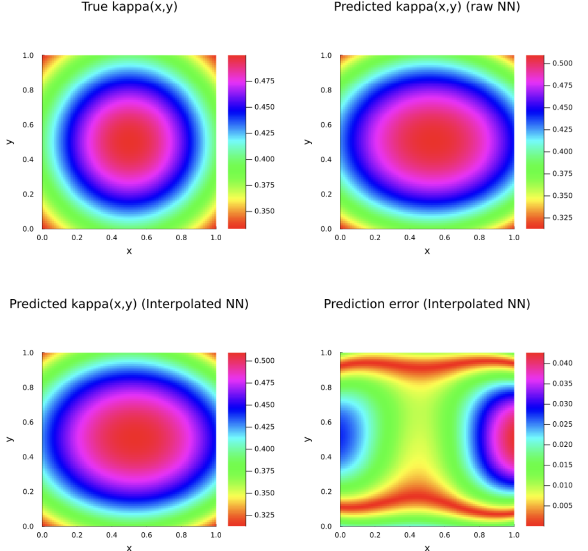
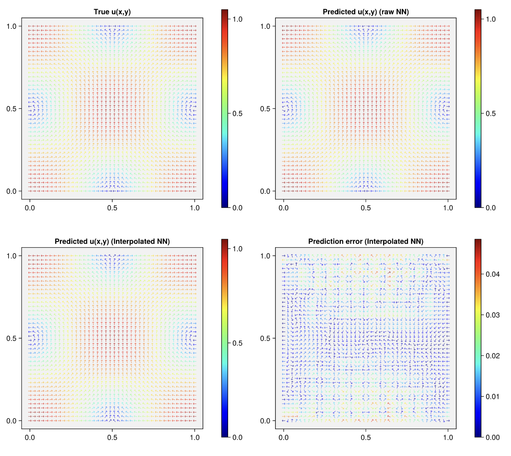

### Introduction

This notebook demonstrates how to fit a finite element interpolated neural network (FEINN) to an inverse electromagnetics problem with sparse, noisy measurements.

### Setup

First, activate the environment and load the required libraries.

```Julia
using Pkg
Pkg.activate(".")

using FiniteElementChains
using Gridap
using Flux
using Gridap.FESpaces
using Gridap.ReferenceFEs
using Gridap.Arrays
using Gridap.Geometry
using Gridap.Fields
using Gridap.CellData
using Gridap.Algebra
using Zygote
using LinearAlgebra
using ForwardDiff
using Distributions
using ChainRules
using Plots
using DelimitedFiles
using Optim
```

Next, we'll set up our test solution. For this problem, the true state and diffusion coefficient are given by:

\begin{equation}
    u(x,y) = [cos(\pi x)cos(\pi y),sin(\pi x)sin(\pi y)], \ \kappa (x) = \frac{1}{1 + x^2 + y^2 + (x-1)^2 + (y-1)^2}
\end{equation}

The underlying physics are represented by the variable coefficient poisson equation:

\begin{equation}
    \nabla \times \nabla \times u + \kappa u = f \text{ in } \Omega, \qquad u \times n = g \text{ on } \Gamma_D = \partial\Omega.
\end{equation}

The domain is given by $[0,1]^2$ and is split into 50x50 quadrilaterals. This is the problem used in section 3.3.2 of Badia et al (2025).

For this problem, we'll assume we can observe the true state at 900 points inside the domain, contaminated with Gaussian noise. 

```Julia
π2 = π^2

# Manufactured solution
E_exact((x,y)) = VectorValue(
    cos(π*x)*cos(π*y),
    sin(π*x)*sin(π*y)
)

kappa((x,y)) = 1/(1 + x^2 + y^2 + (x-1)^2 + (y-1)^2)

Res_exact((x,y)) = VectorValue(
    0.0,
    0.0
)
```

Below, we'll set up our problem using Gridap. Notice we instantiate spaces for both $\kappa (x)$, and for $u (x)$.

```Julia
domain = (0,1,0,1)
partition = (50,50)
model = CartesianDiscreteModel(domain, partition)
order = 1

Ω = Triangulation(model)
dΩ = Measure(Ω, 4)


# set up for the u function
reffe = ReferenceFE(nedelec, order - 1)
V = TestFESpace(
    model,
    reffe;
    conformity=:HCurl,
    dirichlet_tags="boundary"
)
U = TrialFESpace(V, E_exact)  # MMS boundary data
assem = SparseMatrixAssembler(U,V)

# set up for the kappa function
reffek = ReferenceFE(lagrangian, order)
V2 = TestFESpace(
    model,
    reffek;
    conformity=:H1
)
U2 = TrialFESpace(V2)
assem_k = SparseMatrixAssembler(U2,V2)

# useful residual space
Ures = TrialFESpace(V, Res_exact)  


# set up overall problem
J(x) = (2*π2 + kappa(x)) * E_exact(x)
resfunc(k,u,v) = ∫(curl(u) ⋅ curl(v) + k*(u ⋅ v) - J ⋅ v) * dΩ
v_fef = get_fe_basis(V)
resfunc_ku(k,u) = resfunc(k,u,v_fef)

```

We're working with Nedelec elements here. since these degrees of freedom are based on an integral, we need different machinery to work with them compared to a FEINN problem with Lagrangian elements. This package defines a struct called a `MomentBasedElementTools` to deal with those.

```Julia
momentbasedinfo, interior_coords = MomentBasedElementTools(V, Ω)
```

Now, let's extract 900 sensor locations, predict their true values, and contaminate them with gaussian noise.

```Julia
# extract 64 sensor locations, assign them a gaussian noise sensor reading
xpt = collect(range(0.005, 0.995; length=30))
ypt = collect(range(0.005, 0.995; length=30))
known_coords = [Gridap.Point([i,j]) for i in xpt for j in ypt]

noise = 1 .+ 0.05 .* randn(30*30)
known_values = reshape(reinterpret(Float64,E_exact.(known_coords) .* noise),2,length(known_coords))'

# set interior and all nodes
all_coords = V2.fe_dof_basis.trian.grid.node_coords
all_coords = [get_array(i) for i in all_coords]
```

Finally, let's instantiate the structs that will be used to fit our FEINN.

```Julia
U_kap_coords = get_coord_mat(all_coords)
U_u_coords = get_coord_mat(interior_coords)

pdesetup = PDESetup(U,U2,assem,assem_k,U_u_coords,U_kap_coords)
sensordata = SensorData(V,known_values,known_coords)
nnsetup = initialize_networks(2,[2,1],2,50,softplus,rect_abs)

d_used = [1,2] # which dimensions of the simulated field are used

```

### Setting up the loss function

Loss functions exert significant influence over the quality of the final trained model. In this problem, we use the L2 loss of the Riesz representative of the residual vector. We define this using the following snippet.

```Julia
# extract the gram matrix for the problem
a_gram(u,v) = ∫( u ⋅ v + curl(u) ⋅ curl(v) ) * dΩ
M_gram = assemble_matrix(a_gram, Ures, V)
M_gram_fact = cholesky(M_gram)

losseval = LossSetup(riesz_transformed_loss, M_gram_fact, 2)
```

Check out our other tutorials for more details on how loss functions are constructed in FiniteElementChains.jl and what levers are available to pull.

### Training the models

To train the FEINN, simply call train_feinn!. This will modify the parameters in `nnsetup` in place. The models are trained using BFGS and Optim.jl. Typically, we train these models in three stages--first, training the $u(x,y)$ network to minimize data fitting error as a "Warm start," then training $\kappa(x,y)$ to minimize the FEM residual with a fixed $u(x,y)$ network, followed by a continuation strategy where the joint data and FEM errors are minimized with increasing weight on the FEM residual.

See Badia et al (2024), Badia et al (2025) for more information on how these models are trained.

```Julia
train_feinn!([150,50,400], [0.01,0.03], resfunc_ku, nnsetup, pdesetup, sensordata,d_used,losseval,-1.0,0.0,-1.0)
```

### Evaluation

Now, let's evaluate the results. First, we'll take the $L^2(\Omega)$ norm of the prediction error for $u (x)$. Then, we'll plot the predicted results for both $u$ and $\kappa$.

```Julia

kpredfunc, zpbk = get_predictions(
        nnsetup.re_k, 
        nnsetup.θ_k, 
        pdesetup.coords_k, 
        pdesetup.U_kap
        )
e = kpredfunc - kappa
l2_error = sqrt(
    sum(∫( e ⋅ e ) * dΩ)
)/sqrt(sum(∫(x -> E_exact(x)[1]^2 + E_exact(x)[2]^2) * dΩ))

nx, ny = 100, 100
xs = range(0, 1, length=nx)
ys = range(0, 1, length=ny)

dx = xs[2]-xs[1]
dy = ys[2]-ys[1]

xedges = range(xs[1]-dx/2, xs[end]+dx/2, length=nx+1)
yedges = range(ys[1]-dy/2, ys[end]+dy/2, length=ny+1)

function heatmap_feinn(xedges,yedges,err,title)
    p = heatmap(
        xedges,
        yedges,
        err,
        aspect_ratio=:equal,
        xlims=(0,1),
        ylims=(0,1),
        c=:hsv,
        xlabel="x",
        ylabel="y",
        title=title,
        size=(400,400),
        margin=5Plots.mm,
        grid=false
    )
    return p
end

kpred_nn = [nnsetup.re_k(nnsetup.θ_k)([x,y])[1] for y in ys, x in xs]
kpred_feinn = [nnsetup.re_k(nnsetup.θ_k)([x,y])[1] for y in ys, x in xs]
ktrue = [kappa([x,y]) for y in ys, x in xs]
kerr = [abs(kappa([x,y]) - nnsetup.re_k(nnsetup.θ_k)([x,y])[1]) for y in ys, x in xs]

p1 = heatmap_feinn(xedges,yedges,ktrue,"True kappa(x,y)")
p2 = heatmap_feinn(xedges,yedges,kpred_nn,"Predicted kappa(x,y) (raw NN)")
p3 = heatmap_feinn(xedges,yedges,kpred_feinn,"Predicted kappa(x,y) (Interpolated NN)")
p4 = heatmap_feinn(xedges,yedges,kerr,"Prediction error (Interpolated NN)")

p = plot(
    p1, p2, p3, p4,
    layout=(2,2),
    size=(1000, 1000)
)
```


``` Julia

upredfunc, zpbu = get_predictions(
        nnsetup.re_u, 
        nnsetup.θ_u, 
        pdesetup.coords_u, 
        pdesetup.U_u, 
        momentbasedinfo
        )
e = upredfunc - E_exact
l2_error = sqrt(
    sum(∫( e ⋅ e ) * dΩ)
)/sqrt(sum(∫(x -> E_exact(x)[1]^2 + E_exact(x)[2]^2) * dΩ))

fig = Figure(size = (1000, 1000))

fields = [
    E_exact, 
    (x) -> nnsetup.re_u(nnsetup.θ_u)([x[1],x[2]]), 
    x -> upredfunc(Gridap.Point([x[1],x[2]])), 
    x -> (upredfunc(Gridap.Point([x[1],x[2]])) - E_exact(x)) 
]

titles = ["True u(x,y)", "Predicted u(x,y) (raw NN)", "Predicted u(x,y) (Interpolated NN)", "Prediction error (Interpolated NN)"]

for k in 1:4
    # Compute field
    X = Float64[]
    Y = Float64[]
    mag = Float64[]
    ang = Float64[]
    print(k)
    for y in ys, x in xs
        E = fields[k]((x, y))

        push!(X, x)
        push!(Y, y)
        push!(mag, sqrt(E[1]^2 + E[2]^2))
        push!(ang, atan(E[2], E[1]))
    end

    row = (k - 1) ÷ 2 + 1
    col = (k - 1) % 2 + 1

    g = GridLayout(fig[row, col])

    ax = Axis(
        g[1, 1],
        title = titles[k],
        backgroundcolor = :gray95,
        xgridvisible = false,
        ygridvisible = false,
        aspect = DataAspect()
    )

    colorrng = (0,1.05)
    if k == 4
        colorrng = (0,maximum(mag))
    end

    sc = CairoMakie.scatter!(
        ax,
        X, Y,
        marker = '→',
        rotation = ang,
        color = mag,
        colormap = :jet1,#Makie.Reverse(:jet1),
        colorrange = colorrng,
        markersize = 8
    )

    Colorbar(
        g[1, 2],
        sc
    )

    colsize!(g, 1, Relative(0.88))
    colsize!(g, 2, Relative(0.12))
end

fig

```



### Citations

[1] S. Badia, W. Li, and A. F. Martín. “Finite element interpolated neural networks for solving forward
and inverse problems”. In: Computer Methods in Applied Mechanics and Engineering 418 (2024),
p. 116505. doi: 10.1016/j.cma.2023.116505.

[2] S. Badia, W. Li, and A. F. Martín. “COMPATIBLE FINITE ELEMENT INTERPOLATED NEURAL NETWORKS”. In: Computer Methods in Applied Mechanics and Engineering 439 (2025), doi: 10.1016/j.cma.2025.117889.
